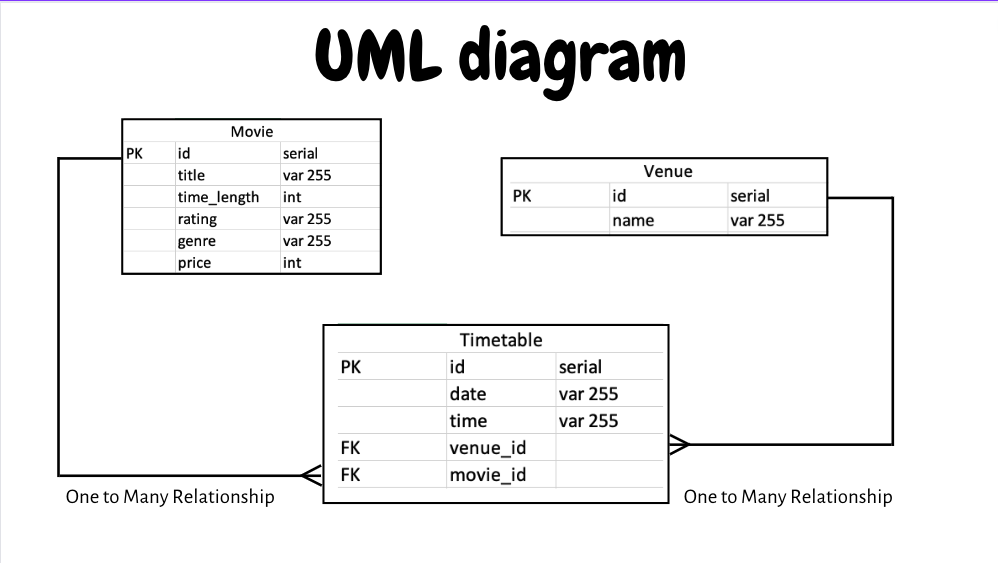
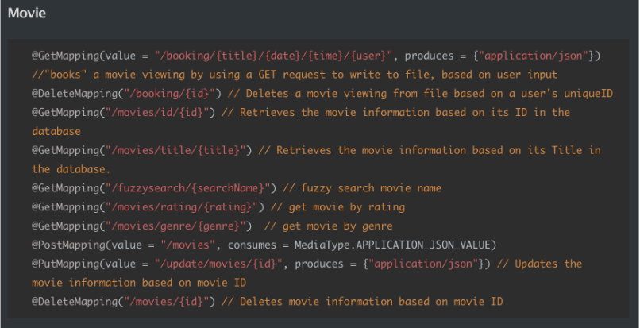
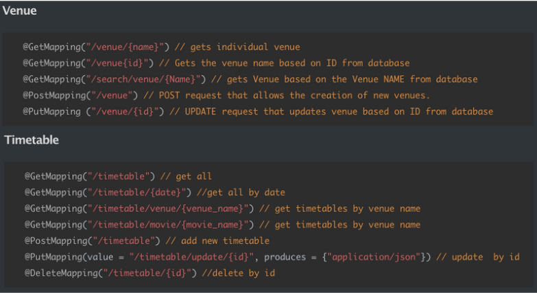

# Movie App Backend

# Table of contents:

1. [ Project Description. ](#project_description)
2. [ Getting started. ](#getting_started)
3. [ Using the project. ](#using_project)
    - [ Booking Movies. ](#booking_movies)
    - [ Delete Movies. ](#delete_movies)
4. [ License. ](#license)


# Project Description <a name="project_description"></a>

This is a Java/Spring application that mimics a movie booking system. It presents all the movies from the database, available timetable for each movie and where to watch it.

From Java's perspective, it contains 3 objects, movie, venue and timetable. The relation between movie with timetable and venue with timetable are both one to many, meaning one movie can have many timetables and one venue can have many timetables.



From Spring boot perspective, it has 4 laysers, persentation layer, business layer, persistence layer, and database layer. It contains controller, repository, model and SQL database to allow users to send and receive requests in JSON format.

This application is part of the project concluding back-end knowledge we learned for the past 6 weeks using Java, Spring and SQL at Bright Network Technology Academy.


# Getting started <a name="getting_started"></a>

Technologies used:
1) [Intellij (Java)](https://www.jetbrains.com/idea/download/#section=mac)

2) [PostgreSQL](https://www.postgresql.org/download/)

3) [Postman](https://www.postman.com)
4) [Spring Boot](https://start.spring.io/)

To run the project, make sure Technologies 1-3 are installed and then do the following:

1) Download repo

2) type **"createdb movieapp"** into terminal

3) Open project locate - **"src/main/resources/application.properties"**
If required, enter postgresql username and password on lines 4 and 5 respectively.

4) Go to **"src/main/java/com.example.MovieApp/controller/MovieController"** on line 69, and **"src/main/java/com.example.MovieApp/BookingMovie"** on line 47 and 66. Change to **"/Users/{INSERT NAME HERE}/Documents/MovieBookings.txt"**

5) Run **"src/main/java/com.example.MovieApp/MovieAppApplication"**


# Using the project <a name="using_project"></a>

Methods Available:




### Basic Method example:

The basic methods such as getting attributes regarding movie, venue and timetable could be realised by sending the following request through [Postman](https://www.postman.com):

```java
localhost:8080/{request}
```

The example request and result is shown below:

```
localhost:8080/movies/title/Maniac
```

Result:
```json
{"id":4,"title":"Maniac","time_length":119,"rating":5,"genre":"Crime|Horror|Mystery|Romance|Thriller","price":15,"timetables":[{"id":73,"date":"Friday","time":"3:29 PM"},{"id":38,"date":"Sunday","time":"6:05 AM"},{"id":18,"date":"Monday","time":"3:43 AM"}]}
```

### Booking Movies: <a name="booking_movies"></a>

This method can write user's request into a lcoal file called **"MovieBookings.txt"**, also presents it in terminal. 

Before using this method, you should check whether the saved file address is correct. You can check it at **"BookingMovie"** file line 47 and 66 and **"MovieController"** file line 69. The advanced usage for booking movie can be realised by sending a request containing the following example: 

```
localhost:8080/booking/Rage of Angels/Monday/2:22 AM/Alex
```

After successfully sending the request in Postman, you should be able to see the following line in terminal and in your local MovieBooking file:

```
User: Alex UniqueID: 911, 
Movie: Rage of Angels', 100 minutes, Movie Rating = 4, Movie Genre = 'Action|Adventure|Drama|Romance', Ticket Price  = £17 
Viewing: Monday' at 2:22 AM' 
Venue: EVERYMAN'
```

### Delete Movies: <a name="delete_movies"></a>

Simply copy the URL below and change **"{unique id}"** to the ID value given in the booking. In the case above we would change it to **"911"**

```
localhost:8080/booking/{unique id}
```
The **"MovieBookings.txt"** file will now be empty.

## License <a name="license"></a>
[Attribution-NonCommercial-NoDerivatives 4.0 International](https://creativecommons.org/licenses/by-nc-nd/4.0/legalcode)


